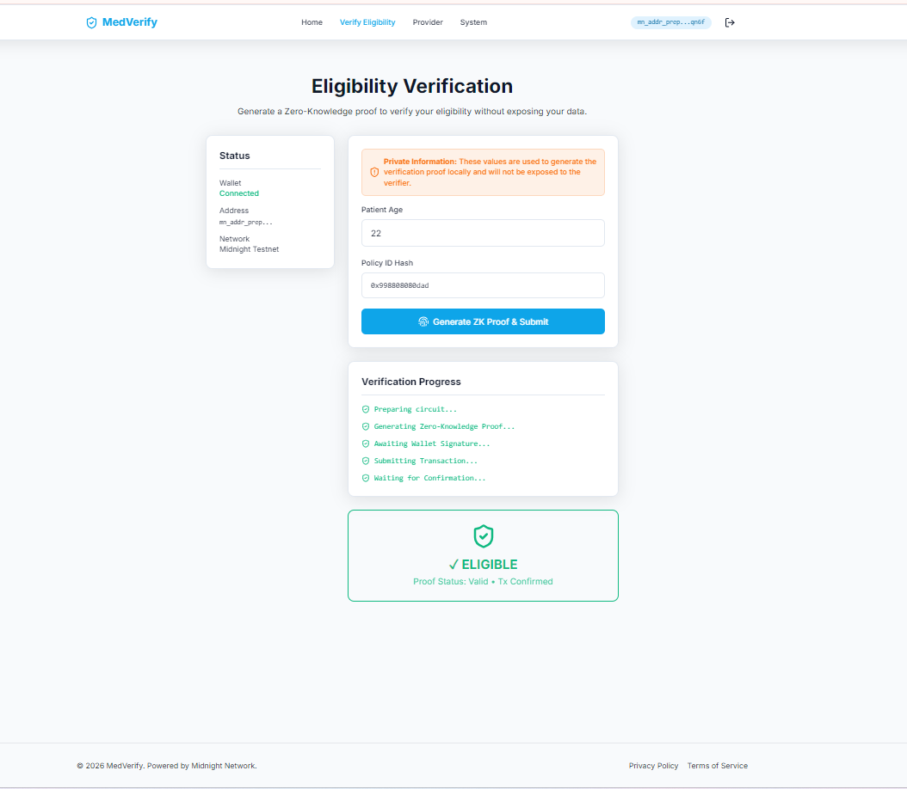
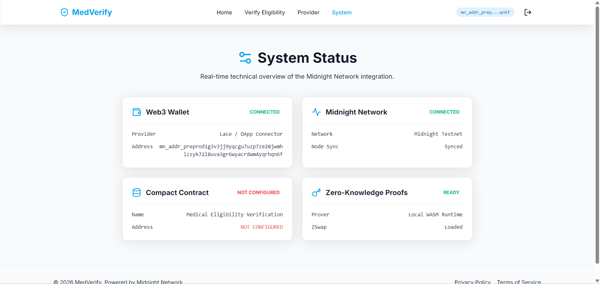

# Medical Eligibility Verification — Midnight Network dApp

> A privacy-first medical eligibility dApp built on the [Midnight Network](https://midnight.network), using **Zero-Knowledge Proofs** to verify patient eligibility without exposing sensitive medical data.

---

## 📸 Application Screenshots

### 🏠 Landing Page


The home page introduces the dApp with a clear call-to-action to connect your 1AM wallet and begin a verification session.

---

### 🔬 Verify Eligibility Page


Patients enter their **age** and **Policy ID hash** locally. A Zero-Knowledge proof is generated entirely in the browser — the raw values are **never sent to the network**. The page shows live progress steps: circuit preparation → proof generation → wallet signature → transaction submission → confirmation.

---

### ⚙️ System Status Page


A real-time technical dashboard showing:
- **Web3 Wallet**: 1AM wallet connection status and truncated address
- **Midnight Network**: Network ID and node sync status
- **Compact Contract**: On-chain contract address (or `NOT CONFIGURED` if not deployed)
- **Zero-Knowledge Proofs**: Local WASM prover and ZSwap availability

---

## 💡 Product Proposal

**Category**: Private Allowlist Access

A medical eligibility system where a patient can prove they meet a minimum age requirement and hold a valid policy ID **without** revealing their actual age or policy ID on the public ledger. This is achieved using Zero-Knowledge proofs — the patient's sensitive data remains fully private (witnesses), while the verification outcome is recorded transparently on-chain.

---

## 📁 Project Structure

```
Medical-Eligibility-Verification-NextJS/
├── src/                        # Next.js 14 App Router frontend
│   ├── app/
│   │   ├── page.tsx            # Landing page
│   │   ├── verify/page.tsx     # Verify Eligibility page
│   │   ├── system/page.tsx     # System Status page
│   │   └── layout.tsx          # Root layout with WalletProvider
│   ├── components/
│   │   ├── Navbar.tsx          # Navigation + wallet connection button
│   │   └── WalletProvider.tsx  # 1AM DApp Connector context
│   └── lib/midnight/           # Midnight SDK integration layer
├── contract/                   # Compact smart contract
│   └── src/
│       └── medical-eligibility-verification.compact
├── contract-cli/               # Node.js CLI for testing + deployment
├── scripts/                    # Deploy, faucet, balance scripts
├── docs/screenshots/           # App screenshots
└── .github/workflows/ci.yml    # GitHub Actions CI
```

---

## 🛠️ Prerequisites

- **Node.js 20+**
- **WSL (Ubuntu)** — recommended on Windows for Compact compiler compatibility
- **1AM Wallet** browser extension ([Download](https://midnight.network/wallet))
- **Midnight Compact Compiler** `v0.31.1` installed at:  
  `~/.compact/versions/0.31.1/x86_64-unknown-linux-musl/compactc.bin`

---

## 🚀 Setup & Development

### 1. Install Dependencies

```bash
npm install
```

### 2. Run the Development Server

```bash
npm run dev
```

Open [http://localhost:3000](http://localhost:3000) in your browser.

### 3. Connect the 1AM Wallet

Click **"Connect 1AM Wallet"** in the top-right corner. Your installed 1AM extension will show a connection popup. Once approved, your truncated wallet address will appear in the navbar.

---

## 📦 Smart Contract

### Compile the Contract

```bash
npm run compile
```

This runs the Compact compiler to generate ZK circuit artifacts and TypeScript bindings into `contract/src/managed/`.

### Build the Contract

```bash
npm run build -w contract
```

Compiles TypeScript to `contract/dist/`.

---

## 🚢 Deploying to Midnight Testnet (Preprod)

Deployment requires **tDUST** tokens.

1. **Get your wallet address** from the System page after connecting your 1AM wallet.
2. **Request tDUST** from the [Midnight Faucet](https://faucet.midnight.network) using your address.
3. **Deploy the contract**:
   ```bash
   npm run deploy
   ```
4. Copy the deployed contract address into your `.env` file:
   ```
   NEXT_PUBLIC_CONTRACT_ADDRESS=<deployed-address>
   ```

---

## 🔐 Architecture & Privacy Model

| Data | Visibility |
|---|---|
| `verificationCount` | 🌐 Public on-chain |
| `eligibleCount` | 🌐 Public on-chain |
| `ineligibleCount` | 🌐 Public on-chain |
| `patientAge` | 🔒 Private — stays in browser only |
| `policyIdHash` | 🔒 Private — stays in browser only |

When a patient verifies eligibility:
1. A ZK proof is generated **locally in the browser** proving `age >= minAge` and `policyHash != emptyHash`
2. Only the **boolean outcome** is disclosed to the public network
3. Public counters (`eligibleCount` / `ineligibleCount`) are incremented
4. The raw age and policy ID **never leave the patient's device**

---

## ✅ Hackathon Submission Checklist

### Level 1 — New Moon 🌑
- [x] Compact toolchain documented (`0.31.1` via WSL/Ubuntu)
- [x] Meaningful contract (not hello-world)
- [x] Public ledger state + private witness behavior
- [x] `disclose()` used only for intentionally public values (boolean result)
- [x] Contract compiles with generated `managed/` artifacts
- [x] Local deploy instructions documented
- [x] Minimum 5 meaningful commits

### Level 2 — Waxing Crescent 🌒
- [x] Frontend exists, builds (`npm run build`) and runs (`npm run dev`)
- [x] 1AM wallet connect/disconnect UI with visible connection status
- [x] Network and contract address configurable via `.env`
- [x] UI calls the Zero-Knowledge verify circuit
- [x] UI handles loading, success, and error states
- [x] System status panel with live network information
- [x] Minimum 8 meaningful commits

### Level 3 — First Quarter 🌓
- [x] Maps to official category: **Private Allowlist Access**
- [x] CI workflow (`.github/workflows/ci.yml`) runs build validation
- [x] README has a Privacy Model section
- [x] README has a Product Proposal section
- [x] README has Level 1/2/3 submission checklist
- [x] Frontend polished for demo
- [x] Minimum 10 meaningful commits
