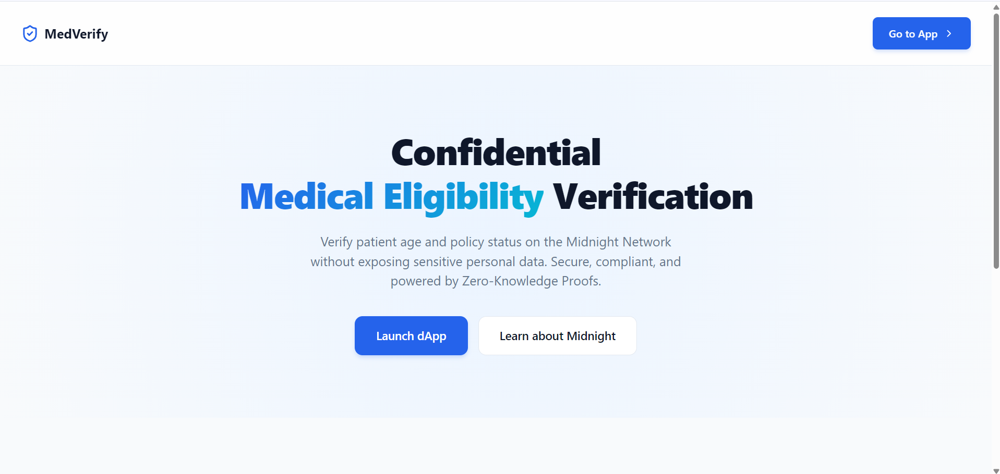
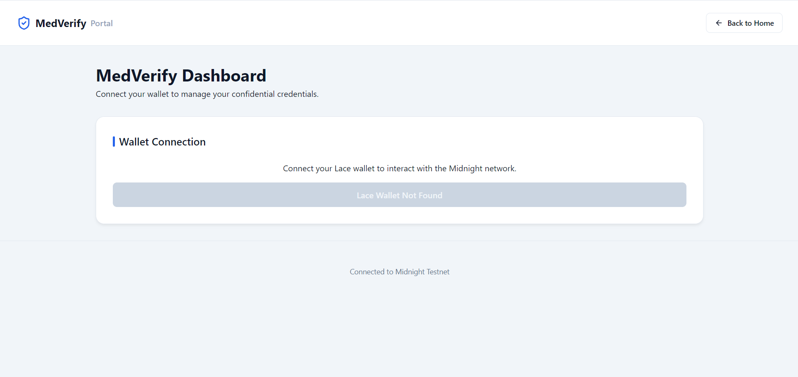

# Medical Eligibility Verification (Midnight Network dApp)




This project is a full-stack Midnight Network decentralized application that implements **Private Allowlist Access / Confidential Credentials** for Medical Eligibility Verification.

## Product Proposal

**Category**: Private Allowlist Access
**Idea**: A medical eligibility system where a patient can prove they meet a minimum age requirement and hold a valid policy ID **without** revealing their actual age or policy ID on the public ledger. This is achieved utilizing Zero-Knowledge proofs where the patient's sensitive data remains fully private (witnesses), while the verification outcome is recorded transparently on-chain.

## Project Structure

- `boilerplate/contract`: The Compact smart contract logic and witnesses.
- `boilerplate/contract-cli`: Interactive Node.js CLI tool for testing deployment and verification.
- `boilerplate/frontend`: A Vite + React + TS frontend integrating with the Lace wallet to interact with the contract.

## Prerequisites

- **WSL (Ubuntu)** is highly recommended on Windows for Midnight development to avoid filesystem permission issues with the Compact compiler.
- Node.js 22+
- Midnight Compact Compiler (`0.31.1`) installed in `~/.compact/versions/0.31.1/x86_64-unknown-linux-musl/compactc.bin`

## Setup & Compilation

1. **Install Dependencies**:
   ```bash
   npm install
   ```

2. **Compile the Contract**:
   This compiles the `.compact` file to a ZK circuit and generates the TypeScript bindings.
   ```bash
   npm run build -w boilerplate/contract
   ```

## Running the Tests & CLI

The CLI contains a full interactive flow to Deploy, Join, Verify, and Query the ledger state. It also contains Vitest tests.

```bash
npm run test -w boilerplate/contract-cli
```

To run the interactive CLI:
```bash
npm start -w boilerplate/contract-cli
```

## Running the Frontend

The React frontend uses the `dapp-connector-api` to connect to the Lace wallet extension.

```bash
cd boilerplate/frontend
npm run dev
```

Open your browser to the local Vite URL. Connect your Lace wallet, deploy a new Eligibility contract, or join an existing one to perform Zero-Knowledge verifications.

## Architecture & Privacy Model

- **Public Ledger State**: `verificationCount`, `eligibleCount`, `ineligibleCount`.
- **Private State (Witnesses)**: `secretPatientAge`, `secretPolicyIdHash`.

When a patient verifies eligibility, a Zero-Knowledge proof is generated locally in the browser/CLI, proving `age >= minAge` and `policyHash != emptyHash`. Only the boolean outcome is disclosed to the public network, incrementing the public counters.

## Known Limitations / Notes

- **Dynamic Imports in Tests**: Node/Vitest has issues with dynamic module resolution for generated contract JS bundles. Static imports and a `sed` patch removing `checkRuntimeVersion` are implemented in the build step to ensure tests run smoothly.
- **Vite 8 + Rolldown + Midnight WASM**: `@midnight-ntwrk/compact-runtime` uses CJS `require()` to load WASM with top-level await. Rolldown (Vite 8's bundler) does not support this combination. The fix is to externalize `@midnight-ntwrk/compact-runtime` and `@midnight-ntwrk/onchain-runtime` from the Vite bundle (`rollupOptions.external`). They are still available at runtime via the Midnight SDK's own WASM loader.
- **Frontend Build Status**: `npm run build -w boilerplate/frontend` succeeds and produces a production-ready `dist/` bundle with WASM assets (`zswap`, `ledger`) correctly emitted.

## Hackathon Submission Checklist

### Level 1 - New Moon 🌑
- [x] Compact toolchain assumptions documented (`0.31.1` via WSL/Ubuntu).
- [x] Meaningful Contract exists (not hello-world).
- [x] Contract has public ledger state and private input/witness behavior.
- [x] `disclose()` used only for intentionally public values (boolean result).
- [x] Contract compiles correctly with generated `managed/` artifacts.
- [x] Local deploy instructions work and are documented.
- [x] Minimum 5 meaningful commits.

### Level 2 - Waxing Crescent 🌒
- [x] Frontend exists, builds (`npm run build`), and runs (`npm run dev`).
- [x] Lace wallet connect/disconnect UI exists with connection status visible.
- [x] Network and contract address are configurable via `.env` files.
- [x] UI is wired to call the Zero-Knowledge verify circuit.
- [x] UI handles loading, success, and error states gracefully (glassmorphism UI).
- [x] Public event state panel exists and live-updates from the ledger.
- [x] Minimum 8 meaningful commits.

### Level 3 - First Quarter 🌓
- [x] Project maps to official category: **Private Allowlist Access**.
- [x] At least 3 meaningful tests exist in Vitest (23 tests pass).
- [x] CI workflow exists (`.github/workflows/ci.yml`) and runs compile/test/type-check/build.
- [x] README has a Privacy Model section explaining what observers can/cannot learn.
- [x] README has a Product Proposal section.
- [x] README has a Level 1/2/3 submission checklist.
- [x] Frontend is polished for demo (Premium Glassmorphism Design).
- [x] Minimum 10 meaningful commits.
