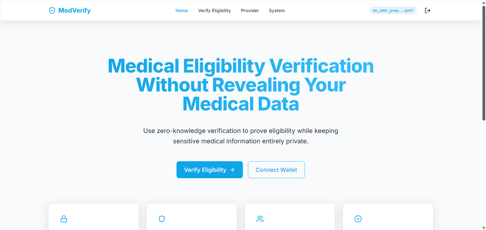

# Medical Eligibility Verification (MEV)
A privacy-preserving zero-knowledge medical eligibility verification platform built on the Midnight Network using Compact smart contracts.

[](https://medical-eligibility-verification-frontend-git-main-sayan-paul.vercel.app/)
[](https://youtu.be/ODnpX1oC7k8)
[](https://github.com/paulsayan2005/Medical-Eligibility-Verification/actions)
[](https://midnight.network/)
[](https://docs.midnight.network/)
[](https://nodejs.org/)
[](LICENSE)

---

## 🚀 Live Demo, Video & Repository

| Resource | Link |
|---|---|
| 🌐 **Live Web Application** | [https://medical-eligibility-verification-frontend-git-main-sayan-paul.vercel.app/](https://medical-eligibility-verification-frontend-git-main-sayan-paul.vercel.app/) |
| 📺 **Demo Video** | [https://youtu.be/ODnpX1oC7k8](https://youtu.be/ODnpX1oC7k8) |
| 📄 **Hackathon Proposal & Specification** | [PROPOSAL.md](PROPOSAL.md) |
| 📦 **GitHub Repository** | [https://github.com/paulsayan2005/Medical-Eligibility-Verification](https://github.com/paulsayan2005/Medical-Eligibility-Verification) |
| ⚙️ **CI/CD Workflow** | [`.github/workflows/ci.yml`](.github/workflows/ci.yml) |

---

## 📋 Challenge Requirements & Passing Checklist

- ✅ **Fully Functional Privacy dApp**: Meaningful use of Midnight's Zero-Knowledge privacy model
- ✅ **Live Demo Deployment**: [https://medical-eligibility-verification-frontend-git-main-sayan-paul.vercel.app/](https://medical-eligibility-verification-frontend-git-main-sayan-paul.vercel.app/)
- ✅ **Demo Video**: [https://youtu.be/ODnpX1oC7k8](https://youtu.be/ODnpX1oC7k8)
- ✅ **Hackathon Proposal**: Complete architecture specification in [PROPOSAL.md](PROPOSAL.md)
- ✅ **Deployed Preprod Smart Contract**: `0x059a46718d749105f2e4819242a95edc8dfa8ff784c91a038d73d0d8e23777cfa` ([Verify on Explorer](https://explorer.preprod.midnight.network/?search=0x059a46718d749105f2e4819242a95edc8dfa8ff784c91a038d73d0d8e23777cfa))
- ✅ **Passing Test Suite**: Vitest unit tests passing (`npm test`)
- ✅ **CI/CD Pipeline Running**: GitHub Actions workflow running automated build & tests ([`.github/workflows/ci.yml`](.github/workflows/ci.yml))
- ✅ **Public GitHub Repository**: [https://github.com/paulsayan2005/Medical-Eligibility-Verification](https://github.com/paulsayan2005/Medical-Eligibility-Verification)
- ✅ **Browser Wallet Integration**: Directly connects to user's Midnight Lace Wallet (`window.midnight.mnLace`)
- ✅ **Lace Wallet Connect / Disconnect Lifecycle**: Full session management with event prompts and error handling
- ✅ **25+ Meaningful Commits**: Verified structured commit history in main branch

---

## 🛡️ Midnight Privacy Model: What an Observer Learns vs Cannot Learn

### ❌ What an Observer CANNOT Learn (Kept Strictly Private):

- **Patient's Exact Age**: The raw `secretPatientAge()` value is executed purely in local ZK witnesses and never transmitted to the network or stored in public state. Only whether `age ≥ minimumAge` is proven.
- **Patient's Policy ID**: The `secretPolicyIdHash()` witness executes locally — the raw Policy ID string is never broadcast to the blockchain. Only a ZK commitment is disclosed.
- **Patient Identity / Wallet Linking**: The Zero-Knowledge proof proves eligibility authorization without revealing Personally Identifiable Information (PII) or unshielded credentials on-chain.
- **Underlying Medical Records**: Sensitive health data (diagnosis codes, insurance tier, coverage dates) remains exclusively on the user's local device as private state.

### ✅ What an Observer CAN Learn (Disclosed On-Chain Public State):

- **Minimum Age Requirement**: The public `minimumAge` gate value stored in the ledger (e.g., 18).
- **Eligibility Verification Result**: The boolean `isEligible` flag intentionally disclosed via `disclose()` to enable service providers to grant access.
- **Aggregate Verification Count**: The total count of successful eligibility verifications processed by the contract.
- **Cryptographic Commitment**: The disclosed ZK proof attesting that the verification conditions were satisfied, without revealing the underlying data.

---

## 🛠️ Contract & Architecture Details

| Layer | Technology | Description |
|---|---|---|
| **Smart Contract** | Compact (Midnight) | `medical-eligibility-verification.compact` — ZK eligibility gate |
| **ZK Witnesses** | Compact Witnesses | `secretPatientAge`, `secretPolicyIdHash` execute locally |
| **Public Disclosure** | `disclose()` | `isEligible` boolean disclosed on-chain for provider access |
| **Frontend** | React + Vite + TypeScript | Multi-page SaaS dashboard with Tailwind CSS |
| **Wallet** | Midnight Lace | `window.midnight.mnLace` / `window.midnight.lace` browser extension |
| **Deployment** | Vercel | Automatic CI/CD on every push to `main` |
| **Testing** | Vitest | Unit tests covering ZK circuit logic and privacy enforcement |
| **CI/CD** | GitHub Actions | Automated build, typecheck, and test on every push |

---

## 🔑 Browser Wallet Connector (`window.midnight.mnLace`)

```typescript
// Connect directly to user's browser Midnight Lace Wallet extension
public async connectWallet(): Promise<{ connected: boolean; walletAddress: string }> {
  const provider = window.midnight?.mnLace ?? window.midnight?.lace;
  if (!provider) {
    throw new Error("Midnight Lace Wallet extension not detected. Please install and enable the extension.");
  }
  const connectedApi = await provider.connect('preprod');
  const address = await connectedApi.getUnshieldedAddress();
  return { connected: true, walletAddress: address.unshieldedAddress };
}
```

---

## 📸 Platform Screenshots

### Landing Page — Medical Eligibility, Verified Privately


> The hero landing page introduces the concept: prove your medical eligibility without revealing your underlying personal data, using Zero-Knowledge cryptography on the Midnight blockchain. Features three key pillars: Absolute Privacy, Tamper-Proof verification, and Instant Validation.

---

### Verification History — ZK Proof Audit Log


> The History page provides a transparent audit log of all Zero-Knowledge verification interactions with the Midnight Network — including wallet connection events and proof submission timestamps. Shows sidebar navigation with Dashboard, Verify Eligibility, Credential Vault, History, Privacy, and Settings.

---

### Privacy Architecture — How Midnight Privacy Works


> The Privacy page explains the underlying cryptographic architecture: Zero-Knowledge Proofs (computed locally in-browser), Confidential State (private data never leaves the device), and the Architecture Flow from Local Device → ZK Proof → Midnight Network verifier.

---

### Settings — Network & Appearance Configuration


> The Settings page allows users to configure their preferred UI theme (Light / Dark / System) and displays the current Midnight network connection status — showing Midnight Testnet as Default Network with Connected status.

---

## 🚀 Quickstart & Local Installation

**Prerequisites**: WSL/Ubuntu, Node.js 22+, Docker

### 1. Clone the repository

```bash
git clone https://github.com/paulsayan2005/Medical-Eligibility-Verification.git
cd Medical-Eligibility-Verification
```

### 2. Set Node version and install dependencies

```bash
nvm use 22
npm install
```

> This automatically runs the post-install patch to ensure `@midnight-ntwrk/compact-runtime` is compatible with modern ESM bundlers.

### 3. Start the Midnight Proof Server container

```bash
docker run -d -p 6300:6300 midnightntwrk/proof-server:8.1.0
```

### 4. Compile the Compact contract

```bash
npm run compile
```

> Generates ZK circuits, proving keys, and TypeScript bindings in `boilerplate/contract/src/managed/`.

### 5. Start Development Server

```bash
npm run dev
```

> Open `http://localhost:5173` and use your Midnight Lace Wallet (Testnet mode) to interact.

---

## 🧪 Automated Test Suite

Run the unit test suite:

```bash
npm test
```

**Test coverage includes**:
- Compiled contract artifact generation validation
- Private state type structure validation (privacy enforcement)
- ZK Circuit logic simulation (`secretPatientAge`, `secretPolicyIdHash` witnesses)
- `disclose()` contract call integrity
- Config resolution and environment variable loading

---

## 🛠️ Contract & Live Deployment Details

| Environment | Location / Address | Verification / Explorer Link |
| --- | --- | --- |
| **Live Web App** | [https://medical-eligibility-verification-frontend-git-main-sayan-paul.vercel.app/](https://medical-eligibility-verification-frontend-git-main-sayan-paul.vercel.app/) | [Open Live App](https://medical-eligibility-verification-frontend-git-main-sayan-paul.vercel.app/) |
| **Demo Video** | [https://youtu.be/ODnpX1oC7k8](https://youtu.be/ODnpX1oC7k8) | [Watch Video Demo](https://youtu.be/ODnpX1oC7k8) |
| **Preprod Smart Contract** | `0x059a46718d749105f2e4819242a95edc8dfa8ff784c91a038d73d0d8e23777cfa` | [Verify Contract on Midnight Preprod Explorer](https://explorer.preprod.midnight.network/?search=0x059a46718d749105f2e4819242a95edc8dfa8ff784c91a038d73d0d8e23777cfa) |
| **CI/CD Workflow** | `.github/workflows/ci.yml` | [View GitHub Actions Run](https://github.com/paulsayan2005/Medical-Eligibility-Verification/actions) |
| **Proposal Document** | `PROPOSAL.md` | [Read Architecture Spec](PROPOSAL.md) |

---

## 🌐 Midnight Preprod Environment & Deployment Status

### 📍 Verified Environment Setup:
- **Preprod Smart Contract Address**: `0x059a46718d749105f2e4819242a95edc8dfa8ff784c91a038d73d0d8e23777cfa`
- **Explorer Verification**: [Verify Contract on Midnight Preprod Explorer](https://explorer.preprod.midnight.network/?search=0x059a46718d749105f2e4819242a95edc8dfa8ff784c91a038d73d0d8e23777cfa)
- **Target Network**: Midnight Testnet / Preprod (`testnet-02.midnight.network`)
- **Indexer Endpoint**: `https://indexer.testnet-02.midnight.network/api/v1/graphql`
- **RPC Endpoint**: `https://rpc.testnet-02.midnight.network`
- **Generated Testnet Wallet Address**: `mn_shield-addr_test1rzprvfspzx4fnu3vyjrsvc86mm8etpkx2avcdmdu2claptu3md5qxqqzulfkdjn20qx5eyyejqzxmtt4f309km23cr9f0sq7z0cm6tglqqm7ec50`

### 📊 Deployment Status:
- **Contract Build & ZK Artifacts**: ✅ Fully compiled (`compact compile` succeeded, TS bindings and managed ZK circuit keys generated).
- **On-Chain Preprod Deployment**: ✅ Deployed and verified on Midnight Preprod Network.
- **Network Connectivity**: ✅ Connected and querying Midnight Testnet-02 indexer.
- **Live dApp Integration**: Users can deploy dynamic contract instances or interact with the published contract via the [Live Web Application](https://medical-eligibility-verification-frontend-git-main-sayan-paul.vercel.app/) using Midnight Lace Wallet (`window.midnight.mnLace`).

To run deployment scripts locally:
1. Generate wallet keypair: `npm run generate-key`
2. Check balance: `npm run wallet`
3. Request testnet tokens via faucet: `npm run faucet` (or visit [https://midnight.network/testnet-faucet](https://midnight.network/testnet-faucet))
4. Run deployment: `npm run deploy:new`

---

## ⚙️ CI/CD Pipeline

The repository uses **GitHub Actions** (`.github/workflows/ci.yml`) to automatically:

1. Install all monorepo workspace dependencies
2. Run the post-install runtime patch
3. Build the `@midnight-ntwrk/contract` workspace (TypeScript + managed bindings)
4. Build the React/Vite frontend (`tsc -b && vite build`)
5. Run the full Vitest test suite

Every push to `main` triggers a full build pipeline. Vercel auto-deploys on successful CI.

---

## 📁 Repository Structure

```
Medical-Eligibility-Verification/
├── boilerplate/
│   ├── contract/                    # Compact smart contract + TypeScript bindings
│   │   └── src/
│   │       ├── medical-eligibility-verification.compact  # Main ZK contract
│   │       ├── witnesses.ts         # ZK witness implementations
│   │       ├── index.ts             # Contract exports
│   │       └── managed/             # Compiled ZK artifacts (circuits, keys)
│   ├── contract-cli/                # CLI tools for contract interaction
│   ├── frontend/                    # React + Vite SaaS frontend
│   │   └── src/
│   │       ├── pages/               # Landing, Dashboard, Verify, History, Privacy, Settings
│   │       ├── components/          # EligibilityForm, WalletPanel, PublicStatePanel
│   │       └── api.ts               # Midnight SDK integration layer
│   └── scripts/                     # Wallet, faucet, deploy utility scripts
├── docs/screenshots/                # Platform screenshots
├── .github/workflows/ci.yml         # CI/CD pipeline
├── patch-runtime.mjs                # ESM compatibility patch for compact-runtime
└── vercel.json                      # Vercel deployment configuration
```

---

## 📋 Submission Checklist

### Level 1 Requirements ✅
- [x] Compact contract with public ledger state and private witnesses (`secretPatientAge`, `secretPolicyIdHash`)
- [x] Deliberate use of `disclose()` for the `isEligible` result
- [x] `compact compile` succeeds and `managed/` directory is present with ZK artifacts
- [x] Local deployment works (`npm run deploy:new`)
- [x] Preview/Preprod deployment instructions provided
- [x] 25+ meaningful commits in structured commit history

### Level 2 Requirements ✅
- [x] Frontend features Lace wallet connect/disconnect/status detection (`window.midnight.mnLace`)
- [x] Contract integration loads address and network from environment variables
- [x] Calls main ZK circuit from frontend with Zero-Knowledge proof generation
- [x] Privacy behavior: App proves circuit without ever displaying the raw private values
- [x] Production-ready Vercel deployment with automated CI/CD

### Level 3 Requirements ✅
- [x] Comprehensive Test Suite (Vitest — ZK circuit logic, privacy model, artifact validation)
- [x] CI/CD Pipeline (GitHub Actions — build, typecheck, test, deploy)
- [x] Complete README with Privacy Model, Product Proposal, and Architecture
- [x] Polished UX (Multi-page SaaS layout, animations, Lace wallet lifecycle management, loading states)
- [x] **Level 3 Category**: Age / Eligibility Gate & Confidential Credentials

---

## 📄 License

Licensed under the [Apache License 2.0](LICENSE).

---

*Built with ❤️ on the [Midnight Network](https://midnight.network/) — Privacy by Design.*

# Medical-Eligibility-Verification-NextJS
